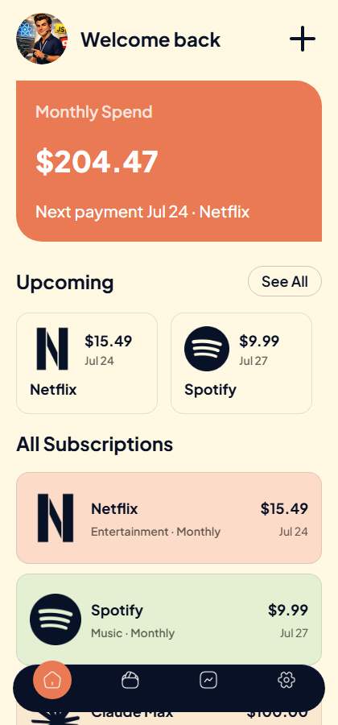
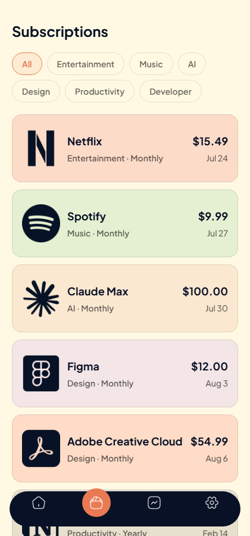
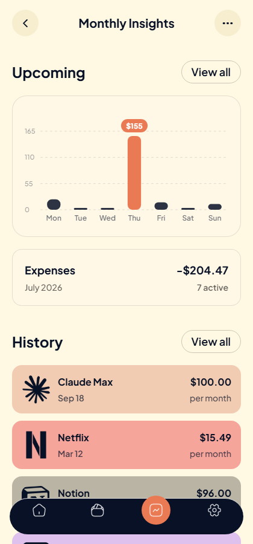

# Recurlly

A subscription tracker built with Expo and React Native — keep tabs on every recurring
payment, see what's coming up, and understand where the money actually goes each month.

|                                             Home                                             |                                       Subscriptions                                        |                                    Monthly Insights                                    |
| :-------------------------------------------------------------------------------------------: | :------------------------------------------------------------------------------------------: | :----------------------------------------------------------------------------------------: |
|  |  |  |

## Features

- **Auth** — email/password sign-up and sign-in with email OTP verification, powered by [Clerk](https://clerk.com).
- **Home dashboard** — total monthly spend, the next payment due, and a quick-glance list of upcoming charges.
- **Subscriptions** — the full list, filterable by category, with a detail view per subscription (billing cycle, next payment, member-since date, cancel).
- **Add a subscription** — a form that auto-resolves a brand icon and color from the name you type (60+ known services, with a category-based fallback for anything else).
- **Monthly Insights** — a weekday spend distribution chart (custom-built with `react-native-svg`, no charting library), a monthly expenses summary, and subscription history.
- **Analytics** — key actions (sign-up, sign-in, subscription created/viewed, sign-out) are instrumented with [PostHog](https://posthog.com).

Onboarding is scaffolded but not yet built out — it's currently a placeholder screen.

## Tech stack

- [Expo](https://docs.expo.dev/versions/v54.0.0/) 54 / React Native 0.81, with [Expo Router](https://docs.expo.dev/router/introduction/) for file-based navigation
- [NativeWind](https://www.nativewind.dev/) (Tailwind CSS v4 for React Native) for styling
- [Clerk](https://clerk.com) for authentication
- [PostHog](https://posthog.com) for product analytics
- [react-native-svg](https://github.com/software-mansion/react-native-svg) for the custom insights chart
- TypeScript throughout

## Getting started

### Prerequisites

- Node.js 18+
- A [Clerk](https://dashboard.clerk.com) application (for its publishable key)
- A [PostHog](https://posthog.com) project (optional — analytics degrade gracefully without it)

### Setup

```bash
npm install
cp .env.example .env
```

Fill in `.env` with your own keys:

```
EXPO_PUBLIC_CLERK_PUBLISHABLE_KEY=pk_test_...
EXPO_PUBLIC_POSTHOG_PROJECT_TOKEN=phc_...
EXPO_PUBLIC_POSTHOG_HOST=https://us.i.posthog.com
```

Then run it:

```bash
npx expo start
```

From the CLI output you can open the app in an iOS simulator, Android emulator, a physical
device via [Expo Go](https://expo.dev/go), or the web.

## Project structure

```
app/                 Expo Router screens (file-based routing)
  (auth)/             Sign-in, sign-up, email verification
  (tabs)/             Home, Subscriptions, Monthly Insights, Settings
  subscriptions/[id]  Subscription detail
components/          Reusable UI (subscription cards, the create-subscription modal, the chart)
constants/           Static subscription data, icon/brand resolution, shared config
context/             App-wide subscription state
lib/                 PostHog client setup
utils/               Formatting/color helpers
```

## License

MIT — see [LICENSE](LICENSE).
